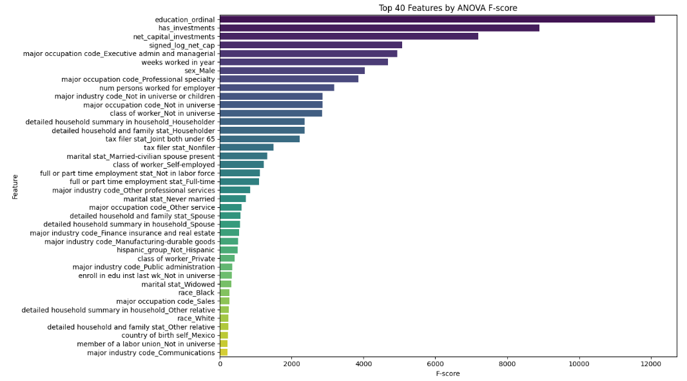
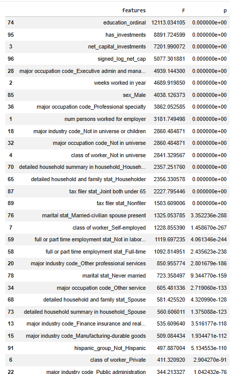
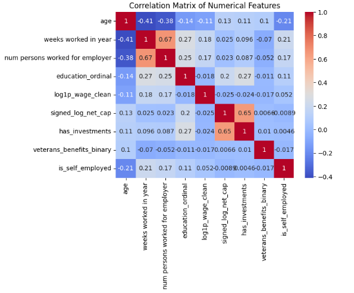
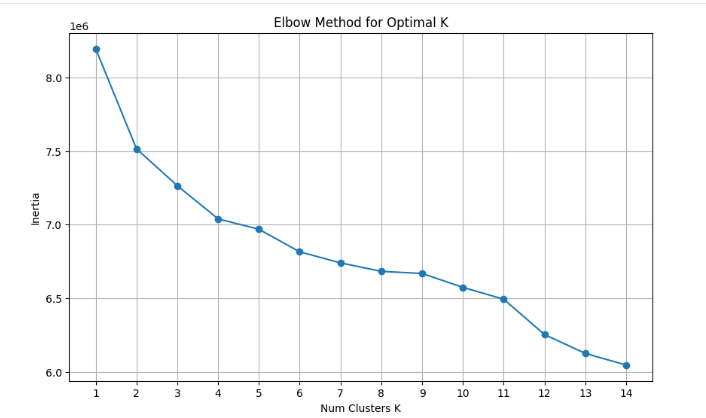
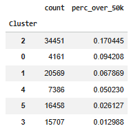

# Data Preprocessing
## Initial Data Exploration & Setup
I use this notebook as a pipeline to transform raw, administrative census data into a clean, feature engineered table to be used for further feature analysis and marketing segmentation and income classification.
I first Imports necessary libraries, and verify the current working directory. I convert the data to a CSV file so I can open it in Excel and look through the data in detail for all columns and features. I load the file containing column names to ensure the 42 variables are correctly indexed and mapped to corresponding demographic data, and add column headers this way. I occasionally use the .info() function to view distributions in the dataset and find patterns. When looking at the label distribution, I see a significant class imbalance for income > 50k. For data reparation, I convert income labels into a binary integer format (0 and 1) for my classification later on.
## Feature Pruning 
After viewing the data, I make a list of 12+ administrative or redundant columns (such as detailed industry codes and migration data) to reduce model noise and focus on actionable marketing drivers. After abserving, I synthesize three fragmented investment variables into a single net_capital_investments feature to provide a cleaner, consolidated feature of an financial net positions. I combine capital gains and losses, emphasizing the importance of "net position" over individual transaction types for simplicity like the equation below.
data['net_capital_investments'] = data['capital gains'] - data['capital losses'] + data['dividends from stocks']

These are the initial dropped columns:
drop_cols = [
    "detailed industry recode",
    "detailed occupation recode",
    "weight",
    "year",
    "region of previous residence",
    "state of previous residence",
    "migration code-change in msa",
    "migration code-change in reg",
    "migration code-move within reg",
    "live in this house 1 year ago",
    "migration prev res in sunbelt",
    'family members under 18',
    "country of birth father",
    "country of birth mother",
    "fill inc questionnaire for veteran's admin" #this col mostly not in universe
]

I also remove redundant financial columns. Then, I observe the distribution of age with an age histogram to understand the population structure and identify demographic clusters that may require specific filtering.
I am able to validate that the senior population (age 65+) contains sufficient high income labels to ensure their inclusion in the "adult" marketing purpose of this project. I see that people under 18 almost never exceed the $50k income threshold, only 2 people do, so I remove this age bracket through assumptions on the client's primary marketing in that it is unlikely to market to children due to the fact that it is highly likely children under 18 have income > 50k. 
## Categorical Encoding
I consolidate "Class of Worker" into broad buckets like "Government" and "Self-employed" to create interpretable employment personas for the client, and reduce the amount of features for modeling simplicity. I also collapse rare industries and occupations (where their counts are < 1000) into "Other" categories before one-hot encoding to prevent the model from learning from statistically insignificant outliers. I also simplify birth country data into a few high frequency regions to maintain geographical signals without exploding the feature space with hundreds of sparse dummies. I do preserve many countries, the top frequent countries such as
I make the complex citizenship status featured into a simplified "is_native" binary flag to capture broad demographic differences with less dimensionality. I standardize unemployment reasons and employment statuses into clear "work intensity" indicators, and format family roles into six major categories (e.g., Householder, Spouse, Child) to better reflect household decision making structures for marketing purposes. I map diverse education strings into a logically ordered ordinal scale, preserving the "progression" of learning which is a major driver of lifetime earnings.
These are the education progression order:
education_order = [
    'Less than high school',
    'High school graduate',
    'Some college / Associate',
    'Bachelor',
    'Master',
    'Professional degree',
    'Doctorate'
]
I finalize the encoding process by converting remaining demographics (sex, race, marital status) into numeric dummies while applying the new ordinal education codes. I also group Hispanic origin categories into three stable buckets to ensure demographic representativeness but reducing the number of over specific features. 
## Numerical Cleaning 
I confirm there are no missing values, and try to identify and remove constant columns that provide zero variance, ensuring the model doesn't learn from non-informative features. I use the remaining data to generates descriptive statistics for numeric features, seeing the extreme skew in the wage and investment variables. I see that the "9999" wage value acts as an outlier and that zeros likely represent non-hourly workers rather than zero income. I make a has_wage indicator to explicitly capture whether an individual is an hourly earner, preserving a key labor-force signal. With this, I clean the wage column by removing outliers and applying a log1p transformation to normalize the extreme right skew distribution. I also make a has_investments binary flag to distinguish investors from those with no capital activity, and add a signed log transformation to capital investments to compress extreme values while preserving the mathematical distinction between financial gains and losses. I also make veteran benefit codes into a simple binary indicator to isolate the effect of receiving benefits on a person’s income profile. There is also a creates a "self-employment" flag from business ownership codes to identify a unique entrepreneurial segment for the client.
Lastly, I drop the original "raw" versions of engineered features (like hourly wage) to eliminate multicollinearity and ensure the final table is fully numeric. I then export the fully cleaned and transformed dataset to a CSV file, for further feature engineering.

# Feature Engineering & Modeling

## Train/test splitting strategy
I do an initial split into training and testing sets using a stratified split (train_test_split(..., stratify=y)), so the proportion of income classes is preserved in both sets. This matters because income >$50K is a minority class, so we split without stratification, the model evaluation could be biased without stratified splitting. 

## ANOVA F-tests 
I find ANOVA F-scores (f_classif) on the training set to rank features by how strongly they differ between income classes, This allows me to find individual features that are most informative for separating >50K vs ≤50K  The strongest signals from my results include education_ordinal, investment activity / net capital, weeks worked, and broad occupation/industry buckets. This is valuable for the business understanding aspect, because even before training any model, I can find income separation could be strongly associated with education, employment intensity, and investment activity, which is consistent with real world expectations. I also see extremely small p-values (often printed as 0). So, I used F-scores as a ranking tool rather than relying on p-values alone.

## Correlation checks on numeric / engineered numeric features 
I also compute a correlation matrix for the small set of continuous/engineered numeric features (age, weeks worked, wage log, signed log capital, education, plus a few binary flags). This is to make sure I don’t remove everything correlated, but I can avoid redundant representations of the same concept. I use this to find multicollinearity, and prevent overweighting a single concept to duplicate columns. 

## Feature removal decisions (business + modeling)
After reviewing the ANOVA rankings (and inspecting low F-score features), I drop feature families that are either not as actionable, add noise/sparsity, or risk dominating my segmentation later on. Specifically, I drop:

	- net_capital_investments (the raw linear version) while signed_log_net_cap, has_investments. This is because the log-transformed representation behaves better with heavy tails and reduces distortion from extreme values.
  
	- All columns beginning with detailed household and family stat_ and country of birth self_ are also dropped, because these families add many dummies, and might sometimes cluster people primarily based on administrative/survey structure rather than the other relevant behavior. I priotitize dropping these from a business perspecfive, because of how these features can be used for marketing and the country of birth does not seem to be significant as a feature.
  
# Classification Model: Random Forest
I use Random Forest as the primary classifier because I have mixed feature types (continuous + many binary dummies) and many nonlinear relationships (income is rarely linear in education/occupation/capital features). I am also able to add weighting strategies because I know my classes are heavily imbalanced.
I trained a baseline Random Forest (n_estimators=100) on my filtered training feature set and evaluated on the held-out test set. I  also experimented with weighting strategies (_weight="balanced" variants) and explored an XGBoost baseline classifier. Through comparing the precision & recall scores, I decided to go with random forest due to having a better performance. I changed the different number of trees and n_estimators, and decided to stick with the current parameters of 100. 
With my model fitted, I make a classification report (precision/recall/F1), and see good performance on class 0 (≤50K), and moderately good performance on class 1 (>50K). 
Precision (class 1) ≈ 0.6866
Recall (class 1) ≈ 0.3893
I can assume the model is conservative when predicting “>50K.” If someone is predicted with income  >50K it’s often correct because of a good precision score, but it misses many true high income individuals  since recall is lower. I would adjust this and fintune this model further based on more marketing insights, to hopefully answer if we want to target fewer people with higher confidence, or capture more high income people at the cost of more false positives? I would tune this and decide on balancing the classes based on these considerations. 
I then find the  PR-AUC / Average Precision (ranking performance under imbalance), and see that Random Forest PR-AUC ≈ 0.5940
This confirms that my RF model is good at ranking high-income people above low income people across thresholds, I find You also compute Precision@k, using k=# of "positives in test dataset" . I see that Precision@3714 ≈ 0.5630
This means if I look at the top ~3714 people (same volume as the number of >50k income cases), about 56% of them are actually having income >50K. With this, I can make a conclusion that even if recall at the default threshold is not as great as precision scores, the model can still be highly valuable to prioritize who to target first based on income levels and demographic groups looking at a certain threshold.
In conclusion, my random forest classifier model is suitable for rank order in targeting an understanding of looking at demographics and seeing who is most likely making >50K in income. It will be useful in finding individuals to market to for those with income <50k.

# Segmentation Model: K-Means Clustering
I use K-Means clustering algorithm to create a segmentation model that groups people by similarity across demographic and employment variables. I use this because kmeans clustering is very fast and scalable, so I decided to cluster X_train features, only use the y label of income afterward for interpretation.
I use StandardScaler to the feature matrix before fitting. To choose the number of clusters, I follow the elbow method and test values of inertia across k=1 to 14 and plot the elbow curve. The elbow method can help me find the point where adding more clusters will diminish improvement in performance. By looking at the graph, I fit a K-Means model with k=6, as my number of segments for fitting into different customer profiles within a business model.

After clustering, you add the cluster labels back to the unscaled training table for profiling. I find the cluster numeric means for interpretable drivers (age, weeks worked, education ordinal, wage log, signed log capital, and indicators like has_investments / is_self_employed) to see how these segments differ on core numeric features. I then add a top differentiating dummy variables per cluster using diff_vs_global, which is:

"diff_vs_global"=P("feature"=1∣"cluster")-P("feature"=1)

I can decide that if it is a positive diff, then I can assume the cluster is strongly characterized by a specific category. This can be used in a marketing or business perspective by thinking of them into profiles or personas like:
	“Transportation / logistics full-time workers”
	“Single retail/service workers”
	“Married professional/managerial households”
	“Not in labor force / nonfiler households”

Bringing back the y label, I compute the share of >50K earners per cluster and identify these clusters:
	Cluster 2: 17.0% >50K
	Cluster 3: ~1.3% >50K
I can see that different segments of clusters differ in high income distributions, which means for marketing purposes I can prioritize marketing to profiles in clusters with higher >50K concentration. I can base this and build it off of the previous classification model, and use both of these for identifying income levels and predicting income levels based on demographic data, and then using these clusters to direct different marketing profiles to clusters of relevant profiles.

References:

https://forum.ipums.org/t/what-does-universe-mean-in-the-variable-descriptions/85 
https://www.geeksforgeeks.org/machine-learning/random-forest-algorithm-in-machine-learning/
https://www.geeksforgeeks.org/machine-learning/elbow-method-for-optimal-value-of-k-in-kmeans/
https://www.geeksforgeeks.org/machine-learning/k-means-clustering-introduction/